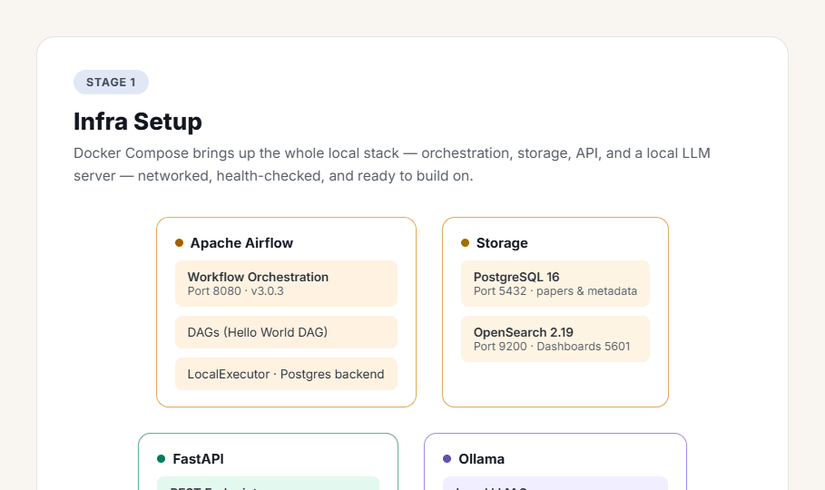
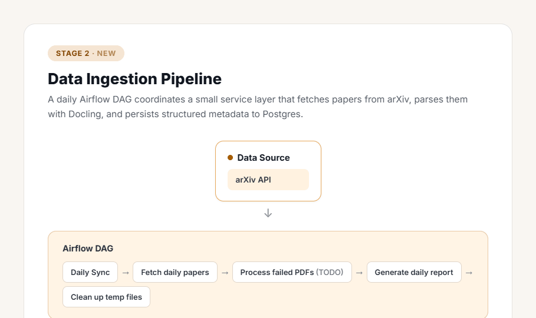
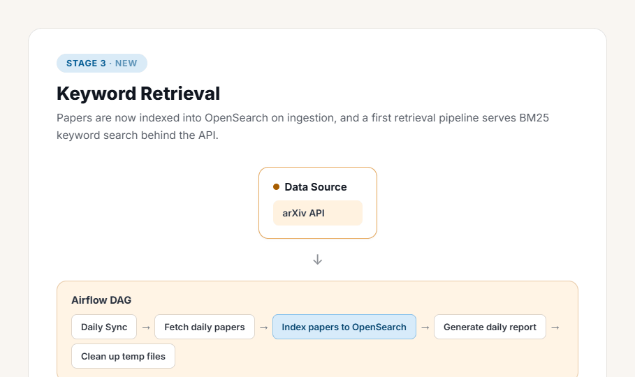
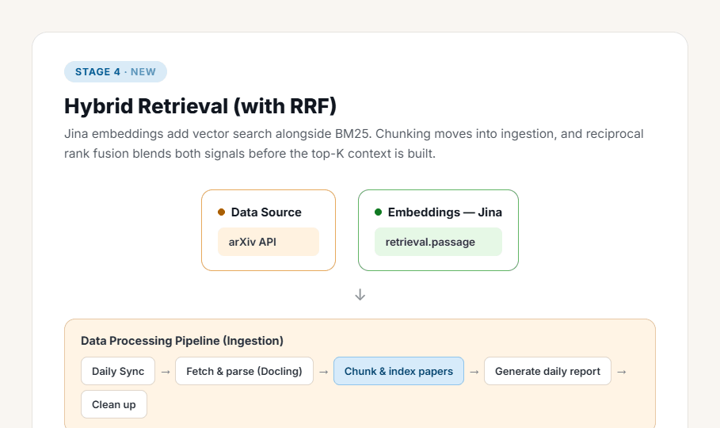
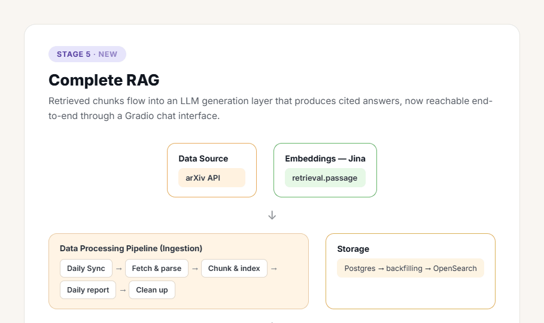
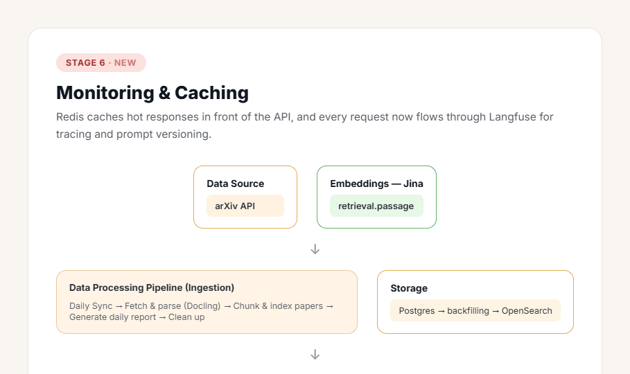
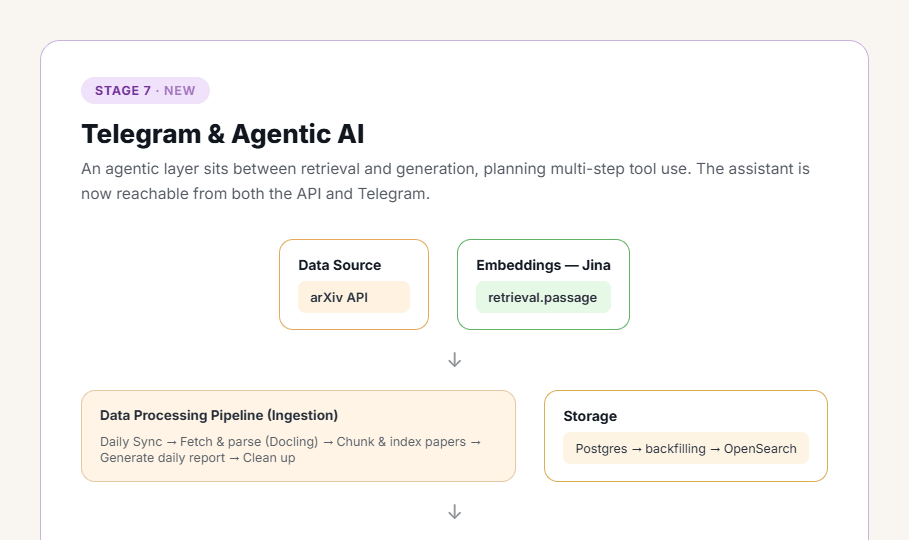

# Papermind

**Production-Grade Agentic RAG System for Academic Research**

<p align="center">
  
  
  
  
  
  
</p>

Papermind is an end-to-end research assistant that automatically ingests academic papers from arXiv, makes them searchable through hybrid keyword and semantic retrieval, and answers research questions with a decision-making agent — accessible over a REST API, a Gradio web interface, and a Telegram bot.

The system is built the way production RAG is built in industry: a solid keyword-search foundation first, enhanced with vector retrieval for hybrid ranking, then layered with generation, caching, observability, and agentic reasoning. Every stage builds strictly on the one before it — nothing is replaced, only extended.

---

## Table of Contents

- [Quick Start](#quick-start)
- [Stage 1 · Infrastructure Foundation](#stage-1--infrastructure-foundation)
- [Stage 2 · Data Ingestion Pipeline](#stage-2--data-ingestion-pipeline)
- [Stage 3 · Keyword Search Foundation](#stage-3--keyword-search-foundation)
- [Stage 4 · Chunking & Hybrid Search](#stage-4--chunking--hybrid-search)
- [Stage 5 · RAG Generation](#stage-5--rag-generation)
- [Stage 6 · Monitoring & Caching](#stage-6--monitoring--caching)
- [Stage 7 · Agentic RAG & Telegram Bot](#stage-7--agentic-rag--telegram-bot)
- [Technology Stack](#technology-stack)
- [Service Access](#service-access)
- [Project Structure](#project-structure)
- [Essential Commands](#essential-commands)

---

## Quick Start

### Prerequisites

- **Docker Desktop** with Docker Compose
- **Python 3.12+**
- **UV Package Manager** — [installation guide](https://docs.astral.sh/uv/getting-started/installation/)
- **8 GB+ RAM** and **20 GB+ free disk space**

### Get Running

```bash
# 1. Clone and enter the project
git clone <repository-url>
cd papermind

# 2. Configure environment (defaults work out of the box)
cp .env.example .env
# Add your Jina embeddings API key and Langfuse keys for Stages 4 and 6

# 3. Install dependencies
uv sync

# 4. Start all services
docker compose up --build -d

# 5. Verify the system is healthy
curl http://localhost:8000/health
```

> **Note:** Airflow credentials are generated in `airflow/simple_auth_manager_passwords.json.generated`.

---

## Stage 1 · Infrastructure Foundation

The containerized backbone that powers every later stage: API, storage, search, orchestration, and local inference, wired together through Docker Compose with health checks on each service.

<p align="center">
  
</p>

| Service | Port(s) | Role |
|---|---|---|
| FastAPI | 8000 | REST API, async, automatic docs |
| PostgreSQL 16 | 5432 | Paper metadata and parsed content |
| OpenSearch 2.19 | 9200, 5601 | Search engine and dashboards |
| Airflow 3.0 | 8080 | Scheduled ingestion DAGs |
| Ollama | 11434 | Local LLM inference |

---

## Stage 2 · Data Ingestion Pipeline

Automated fetching, parsing, and storage of academic papers. Orchestrated by `MetadataFetcher`, with upserts keyed on `arxiv_id` so daily re-runs stay idempotent. The Airflow DAG runs `setup → fetch → parse → store → report → cleanup`.

<p align="center">
  
</p>

| Metric | Value |
|---|---|
| arXiv throughput | ~20 papers/min |
| PDF parse time | 2–5 s/paper |
| Fetch success rate | 95%+ |
| PDF parse success rate | 80–90% |

---

## Stage 3 · Keyword Search Foundation

The keyword-search layer professional RAG systems rely on before adding vectors. Papers migrate from PostgreSQL into an OpenSearch index and are served through a BM25 query path with field boosting and rich result formatting.

<p align="center">
  
</p>

Field boosting weights **title ×3, abstract ×2, content ×1**. Features include result highlighting, pagination, category filters, fuzzy matching, and two-letter query support (AI, ML, NN, CV), with sub-100 ms latency on the test corpus.

---

## Stage 4 · Chunking & Hybrid Search

The semantic layer. Documents are chunked section-aware, embedded with Jina, and served from a single unified index that supports keyword, vector, and hybrid retrieval — fused with Reciprocal Rank Fusion.

<p align="center">
  
</p>

| Mode | Latency | Recall@10 | Precision@10 |
|---|---|---|---|
| BM25 Only | 52 ms | 0.78 | 0.65 |
| Vector Only | 105 ms | 0.82 | 0.71 |
| **Hybrid (RRF)** | 2.4 s | **0.89** | **0.84** |

A single index, `arxiv-papers-chunks`, serves all three modes and falls back to BM25-only automatically if the embedding service is unavailable.

**Endpoint:** `POST /api/v1/hybrid-search/`

---

## Stage 5 · RAG Generation

The generation layer that turns retrieval into conversation. Retrieved chunks are deduplicated and assembled into context, then passed to a local Ollama model that produces cited answers, with an optional streaming path for low time-to-first-token.

<p align="center">
  
</p>

| Endpoint | Behavior | Time |
|---|---|---|
| `POST /api/v1/ask` | Full response with metadata | 15–20 s |
| `POST /api/v1/stream` | SSE token streaming | 2–3 s to first token |

Optimizations include an 80% prompt reduction (a 6× speedup from ~120 s to 15–20 s), a 300-word answer cap, and automatic deduplication of cited sources. The Gradio UI runs on port 7861.

---

## Stage 6 · Monitoring & Caching

Production observability and performance. A parameter-aware Redis cache short-circuits repeated queries, while Langfuse traces latency, cost, and quality on every request.

<p align="center">
  
</p>

| Scenario | Time | Change |
|---|---|---|
| Cache miss | 15–20 s | baseline |
| **Cache hit** | **50–100 ms** | **150–400× faster** |
| Monitoring overhead | <2% | negligible |

Cache keys incorporate the query, `top_k`, retrieval mode, and model, so results never collide across different request shapes.

---

## Stage 7 · Agentic RAG & Telegram Bot

The reasoning layer. A LangGraph workflow adds guardrails, document grading, and adaptive query rewriting, then exposes the whole system over both an API endpoint and a Telegram bot for mobile access.

<p align="center">
  
</p>

| Node | File | Responsibility |
|---|---|---|
| `guardrail` | `nodes/guardrail_node.py` | Domain-relevance check before retrieval |
| `out_of_scope` | `nodes/out_of_scope_node.py` | Polite decline for off-topic queries |
| `retrieve` | `nodes/retrieve_node.py` | Builds the retrieval tool call |
| `tool_retrieve` | LangGraph `ToolNode` | Executes hybrid search |
| `grade_documents` | `nodes/grade_documents_node.py` | Scores retrieved document relevance |
| `rewrite_query` | `nodes/rewrite_query_node.py` | Reformulates the query and loops back |
| `generate_answer` | `nodes/generate_answer_node.py` | Final cited answer via Ollama |

**Endpoint:** `POST /api/v1/ask-agentic` — returns `answer`, `sources`, `reasoning_steps`, and `retrieval_attempts`.

Commands: `/start` `/help` `/ask` `/search` `/settings` `/status` `/clear`. Access control is handled through `TELEGRAM__ALLOWED_USER_IDS` (empty = open, populated = whitelist).

```bash
TELEGRAM__ENABLED=true
TELEGRAM__BOT_TOKEN=your_token_here
TELEGRAM__USE_WEBHOOK=false
docker compose up --build -d
```

---

## Technology Stack

| Service | Purpose |
|---|---|
| FastAPI | REST API |
| PostgreSQL 16 | Metadata storage |
| OpenSearch 2.19 | BM25 + vector search |
| Apache Airflow 3.0 | Workflow automation |
| Jina AI | Embeddings (1024-dim) |
| Ollama | Local LLM serving |
| Redis | Response caching |
| Langfuse | Observability |
| LangGraph | Agent orchestration |
| Telegram Bot API | Mobile interface |

**Development tooling:** UV, Ruff, MyPy, Pytest, Docker Compose.

---

## Service Access

| Service | URL | Purpose |
|---|---|---|
| API Documentation | http://localhost:8000/docs | Interactive API explorer |
| Gradio UI | http://localhost:7861 | Conversational web interface |
| Langfuse | http://localhost:3000 | Pipeline monitoring and tracing |
| Airflow | http://localhost:8080 | Workflow management |
| OpenSearch Dashboards | http://localhost:5601 | Search engine UI |

---

## Project Structure

```
papermind/
├── src/
│   ├── routers/          # API endpoints (search, ask, papers, agentic)
│   ├── services/         # Business logic (opensearch, ollama, agents, cache)
│   │   └── agents/nodes/ # LangGraph agent nodes
│   ├── models/           # SQLAlchemy database models
│   ├── schemas/          # Pydantic validation schemas
│   └── config.py         # Environment configuration
├── notebooks/            # Staged learning materials (stage1–7)
├── airflow/              # Workflow orchestration (DAGs)
├── tests/                # Test suite
└── compose.yml           # Docker service orchestration
```

---

## Essential Commands

```bash
make start     # Start all services
make health    # Check service health
make test      # Run tests
make stop      # Stop services
```

| Command | Description |
|---|---|
| `make start` | Start all services |
| `make stop` | Stop all services |
| `make restart` | Restart all services |
| `make status` | Show service status |
| `make logs` | Show service logs |
| `make health` | Check all services health |
| `make setup` | Install Python dependencies |
| `make format` | Format code |
| `make lint` | Lint and type-check |
| `make test` | Run tests |
| `make test-cov` | Run tests with coverage |
| `make clean` | Tear everything down |

---

## License

Released under the MIT License. See [LICENSE](LICENSE) for details.