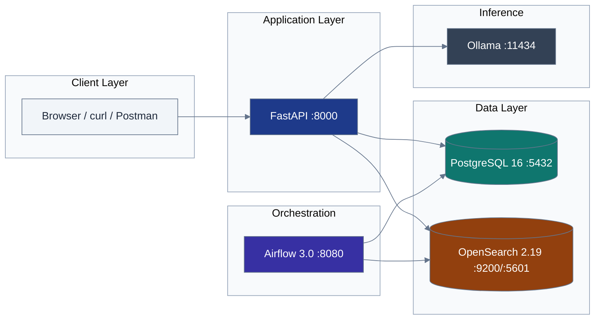
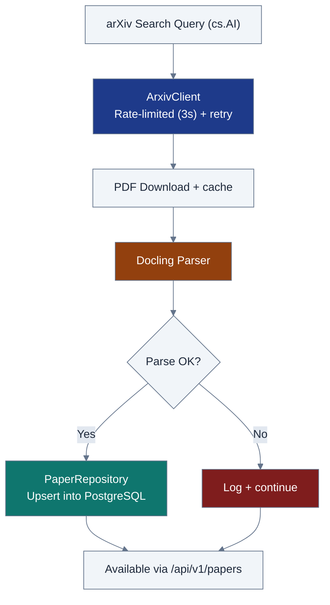
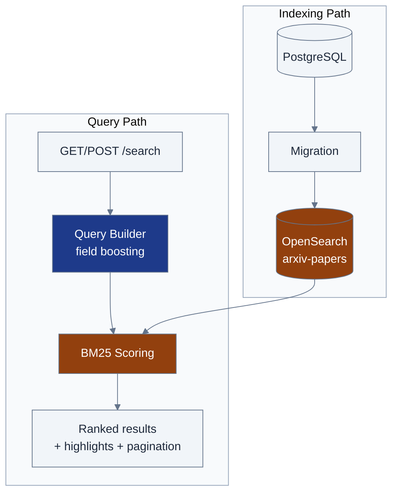
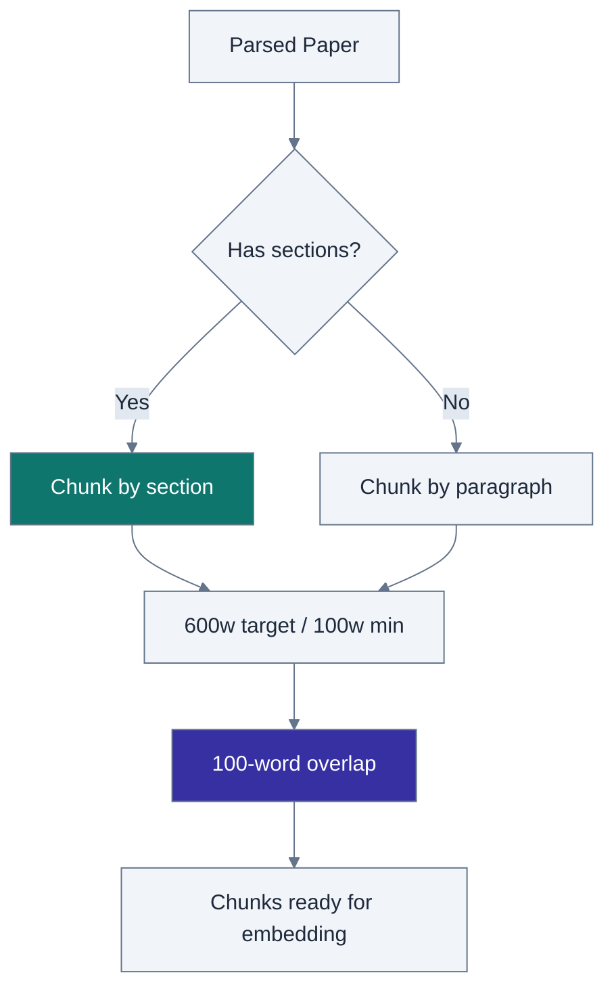
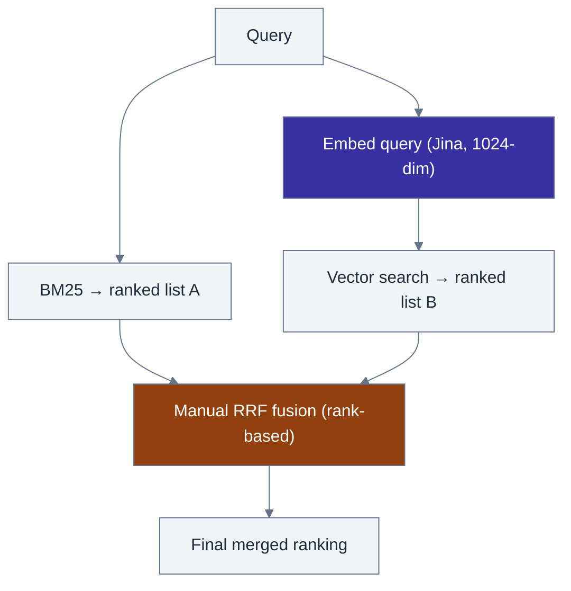
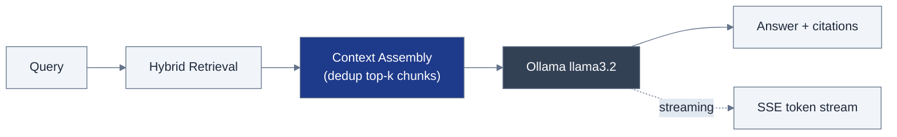
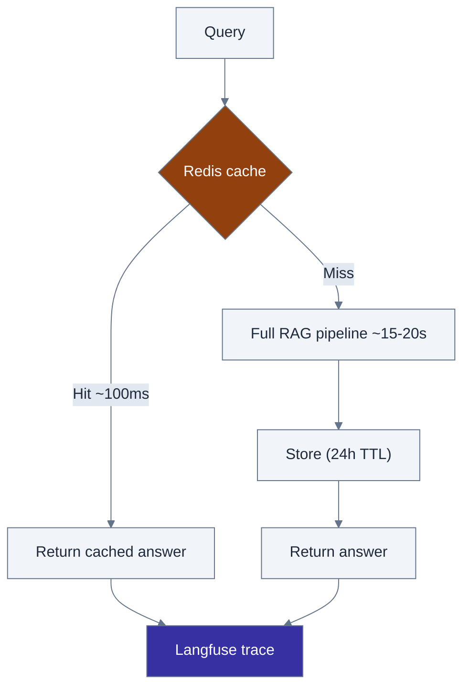
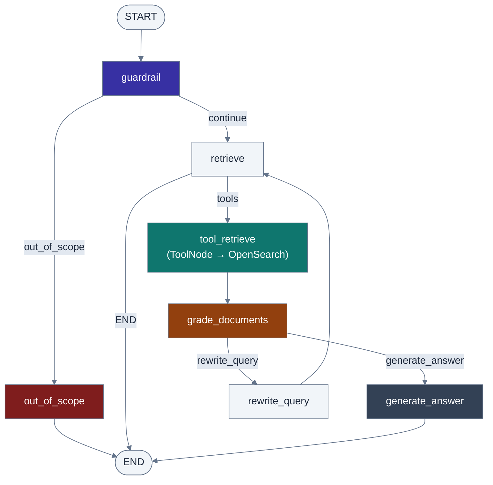
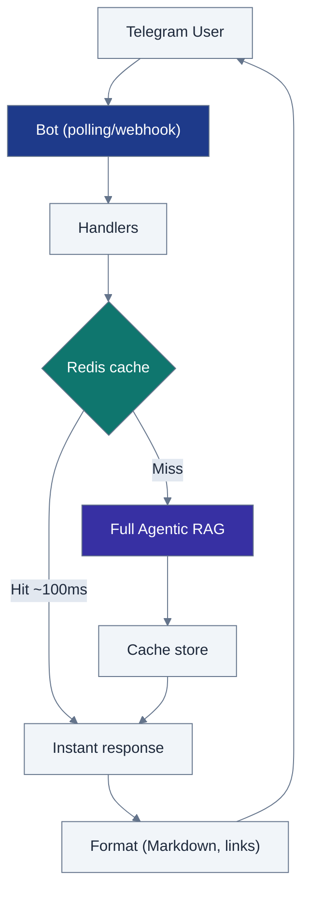

# Papermind
**Production Agentic RAG System · Full Architecture Reference**
---

## Master End-to-End Flow

Everything below is one continuous pipeline. This is the whole system, start to finish.

```mermaid
%%{init: {'theme': 'base', 'themeVariables': { 'primaryColor': '#f1f5f9', 'primaryTextColor': '#1e293b', 'primaryBorderColor': '#64748b', 'lineColor': '#64748b', 'secondaryColor': '#e2e8f0', 'tertiaryColor': '#f8fafc', 'clusterBkg': '#f8fafc', 'clusterBorder': '#94a3b8' }}}%%
flowchart TD
    subgraph P1["Phase 1 · Infrastructure"]
        PG[("PostgreSQL")]
        OS[("OpenSearch")]
        AF["Airflow"]
        OL["Ollama"]
    end

    subgraph P2["Phase 2 · Ingestion"]
        ARX["arXiv API\n(rate-limited)"] --> DL["PDF Download"]
        DL --> PARSE["Docling Parser"]
        PARSE --> UPSERT["Upsert → PostgreSQL"]
    end

    subgraph P3["Phase 3 · Keyword Search"]
        UPSERT --> MIG["Migrate to OpenSearch"]
        MIG --> BM25["BM25 Index\n(title×3, abstract×2, content×1)"]
    end

    subgraph P4["Phase 4 · Chunking + Hybrid"]
        BM25 --> CHUNK["Section-based Chunking\n(600w / 100w overlap)"]
        CHUNK --> EMBED["Jina Embeddings\n(1024-dim)"]
        EMBED --> HYB[("Unified Index\narxiv-papers-chunks")]
        HYB --> RRF["Hybrid Search\n(BM25 + Vector → RRF fusion)"]
    end

    subgraph P5["Phase 5 · RAG Generation"]
        RRF --> CTX["Context Assembly"]
        CTX --> LLM["Ollama LLM\n(llama3.2)"]
        LLM --> STREAM["/ask + /stream endpoints"]
    end

    subgraph P6["Phase 6 · Monitoring + Caching"]
        STREAM --> RCACHE{Redis Cache}
        RCACHE -- hit --> FAST["~100ms response"]
        RCACHE -- miss --> TRACE["Langfuse Trace\n(latency, cost, quality)"]
        TRACE --> FAST
    end

    subgraph P7["Phase 7 · Agentic RAG + Telegram"]
        FAST --> GUARD["Guardrail Node"]
        GUARD -- in-scope --> RETR["Retrieve"]
        GUARD -- out-of-scope --> DECLINE["Polite decline"]
        RETR --> GRADE{Grade\nDocuments}
        GRADE -- relevant --> GEN["Generate Answer"]
        GRADE -- not relevant --> REWRITE["Rewrite Query"] --> RETR
        GEN --> API["/api/v1/ask-agentic"]
        API --> TG["Telegram Bot"]
        API --> WEB["Gradio Web UI"]
    end

    PG -.persists.-> UPSERT
    OS -.powers.-> BM25
    AF -.schedules.-> ARX
    OL -.serves.-> LLM

    style BM25 fill:#92400e,color:#fff
    style HYB fill:#92400e,color:#fff
    style RRF fill:#92400e,color:#fff
    style EMBED fill:#3730a3,color:#fff
    style GUARD fill:#3730a3,color:#fff
    style GRADE fill:#3730a3,color:#fff
    style LLM fill:#334155,color:#fff
    style GEN fill:#334155,color:#fff
    style RCACHE fill:#0f766e,color:#fff
    style TRACE fill:#0f766e,color:#fff
    style DECLINE fill:#7f1d1d,color:#fff
```



**Reading it left to right:** raw papers come in (Phase 1–2), get made searchable two ways (Phase 3 keyword, Phase 4 hybrid), get turned into generated answers (Phase 5), get cached and observed (Phase 6), and finally get wrapped in a decision-making agent exposed over API/Telegram/Gradio (Phase 7). Every later phase builds strictly on top of the one before it — nothing is replaced, only layered.

---

## 1 · Infrastructure Foundation (Phase 1)



| Service | Port(s) | Role |
|---|---|---|
| FastAPI | 8000 | REST API, async, auto docs |
| PostgreSQL 16 | 5432 | Paper metadata & parsed content |
| OpenSearch 2.19 | 9200, 5601 | Search engine + dashboards |
| Airflow 3.0 | 8080 | Scheduled ingestion DAGs |
| Ollama | 11434 | Local LLM inference |

```bash
git clone <repository-url> && cd papermind
cp .env.example .env
uv sync
docker compose up --build -d
curl http://localhost:8000/health
```

---

## 2 · Data Ingestion Pipeline (Phase 2)



Orchestrated by `MetadataFetcher`. Upsert keyed on `arxiv_id` keeps daily re-runs idempotent. Airflow DAG: `setup → fetch → parse → store → report → cleanup`.

| Metric | Value |
|---|---|
| arXiv throughput | ~20 papers/min |
| PDF parse time | 2–5s/paper |
| Fetch success rate | 95%+ |
| PDF parse success rate | 80–90% |

---

## 3 · Keyword Search Foundation (Phase 3)



Field boosting: **title ×3, abstract ×2, content ×1**. Features: highlighting, pagination, category filters, fuzzy matching, two-letter query support (AI, ML, NN, CV). Sub-100ms latency on a 28+ paper test corpus.

---

## 4 · Chunking & Hybrid Search (Phase 4)





| Mode | Latency | Recall@10 | Precision@10 |
|---|---|---|---|
| BM25 Only | 52ms | 0.78 | 0.65 |
| Vector Only | 105ms | 0.82 | 0.71 |
| **Hybrid (RRF)** | 2.4s | **0.89** | **0.84** |

Single index `arxiv-papers-chunks` serves all three modes. Falls back to BM25-only automatically if the embedding service is unavailable.

**Endpoint:** `POST /api/v1/hybrid-search/`

---

## 5 · Complete RAG Generation (Phase 5)



| Endpoint | Behavior | Time |
|---|---|---|
| `POST /api/v1/ask` | Full response + metadata | 15–20s |
| `POST /api/v1/stream` | SSE token streaming | 2–3s to first token |

Optimizations: 80% prompt reduction, 6x speedup (120s → 15–20s), 300-word cap, automatic dedup of cited sources. Gradio UI on port 7861.

---

## 6 · Production Monitoring & Caching (Phase 6)



| Scenario | Time | Change |
|---|---|---|
| Cache miss | 15–20s | baseline |
| **Cache hit** | **50–100ms** | **150–400x faster** |
| Monitoring overhead | <2% | negligible |

Cache keys are parameter-aware (query + top_k + mode + model). Langfuse traces latency, cost, and quality per request.

---

## 7 · Agentic RAG & Telegram Bot (Phase 7)



| Node | File | Job |
|---|---|---|
| `guardrail` | `nodes/guardrail_node.py` | Domain-relevance check before retrieval |
| `out_of_scope` | `nodes/out_of_scope_node.py` | Polite decline for off-topic queries |
| `retrieve` | `nodes/retrieve_node.py` | Builds retrieval tool call |
| `tool_retrieve` | LangGraph `ToolNode` | Executes hybrid search |
| `grade_documents` | `nodes/grade_documents_node.py` | Scores retrieved doc relevance |
| `rewrite_query` | `nodes/rewrite_query_node.py` | Reformulates query, loops back |
| `generate_answer` | `nodes/generate_answer_node.py` | Final cited answer via Ollama |

**Endpoint:** `POST /api/v1/ask-agentic` — returns `answer`, `sources`, `reasoning_steps`, `retrieval_attempts`.

### Telegram Bot



Commands: `/start` `/help` `/ask` `/search` `/settings` `/status` `/clear`. Access control via `TELEGRAM__ALLOWED_USER_IDS` (empty = open, populated = whitelist).

```bash
TELEGRAM__ENABLED=true
TELEGRAM__BOT_TOKEN=your_token_here
TELEGRAM__USE_WEBHOOK=false
docker compose up --build -d
```

---

## Technology Stack

| Service | Purpose |
|---|---|
| FastAPI | REST API |
| PostgreSQL 16 | Metadata storage |
| OpenSearch 2.19 | BM25 + vector search |
| Apache Airflow 3.0 | Workflow automation |
| Jina AI | Embeddings (1024-dim) |
| Ollama | Local LLM serving |
| Redis | Response caching |
| Langfuse | Observability |
| LangGraph | Agent orchestration |
| Telegram Bot API | Mobile interface |

## Service Access

| Service | URL |
|---|---|
| API Docs | http://localhost:8000/docs |
| Gradio UI | http://localhost:7861 |
| Langfuse | http://localhost:3000 |
| Airflow | http://localhost:8080 |
| OpenSearch Dashboards | http://localhost:5601 |

## Essential Commands

```bash
make start    # Start all services
make health   # Check service health
make test     # Run tests
make stop     # Stop services
```
